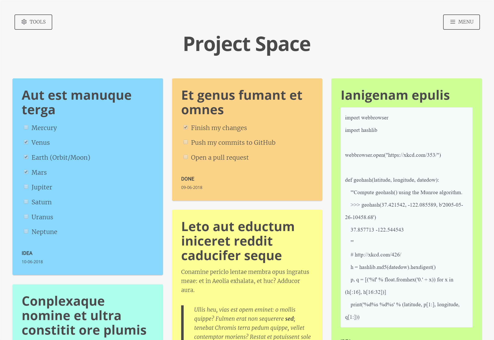
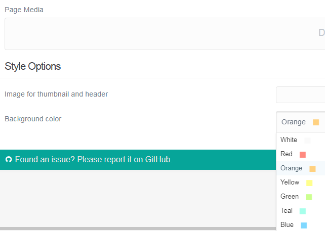
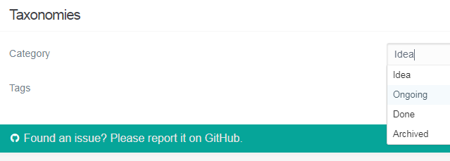

# Project Space Theme



## Description

Visualize projects in an organized manner, as notes on a board. Projects can be categorized, color-coded and tagged to be easily identified, and displayed in a variety of ways with filtering and sorting.

The Project Space theme is responsive, and its use of JavaScript is minimal and only as progressive enhancements. The theme is designed by the [Graceful degradation](https://developer.mozilla.org/en-US/docs/Glossary/Graceful_degradation) methodology, wherein JavaScript is not necessary for the site to function. Scripts include [PJAX](https://github.com/MoOx/pjax), [DatePicker](https://github.com/fengyuanchen/datepicker) for calendar, and [Multiple Select](https://github.com/wenzhixin/multiple-select/) for dropdowns.

## Usage

Create a folder in /user/pages that will store your project-notes, like /projects. In this folder, create a `default.md`-file with the following content:

```
---
title: Project Space

sitemap:
    changefreq: monthly
    priority: 1.03
feed:
    description: Projects
    limit: 10
---
```

Using any FrontMatter you prefer, of course. Each child-page, ie. folder below this page, is treated as a note when you visit the page. For example, a typical note may be in the folder /user/pages/projects/et-genus-fumant-et-omnes, and look like this:

```
---
title: 'Et genus fumant et omnes'
color: orange
taxonomy:
    category: Ongoing
    tag:
        - 'Lorem Ipsum'
---

- [x] Finish my changes
- [ ] Push my commits to GitHub
- [ ] Open a pull request
```

The headers `color` and `taxonomy` are completely optional, and only the former affects the styling of the note. `taxonomy.category` should be a string, not a list. `taxonomy.tag` should, however, be a list of tags. `color` may be one of:

- `white`: White
- `red`: Red
- `orange`: Orange
- `yellow`: Yellow
- `green`: Green
- `teal`: Teal
- `blue`: Blue
- `dark-blue`: Dark Blue
- `purple`: Purple
- `pink`: Pink
- `brown`: Brown
- `gray`: Gray

Categories are defined as a list in `site.yaml`, for example:

```
taxonomies: [category,tag]
categories:
  - Idea
  - Ongoing
  - Done
  - Archived
```

Note that `taxonomies: [category,tag]` is necessary for Grav to recognize that your pages use the `category` and `tag` taxonomies.

### With the Admin-plugin

If you are using the Admin-plugin, this is very easy to manage when editing a page:

#### Style options:



These settings are in the Content-tab, just below where you write the Markdown for your note.

#### Taxonomy options:



These settings are in the Options-tab, just below where you change the settings for Publishing.

### Available layouts, filters and sorting

All options are managed through the Tools-menu, and applied as URL-parameters to the page.

#### Display mode (`display`):
- Blocks (default): Masonry-layout
- List: Listed vertically
- Category: Grouped by category, list
- Color: Grouped by color, list

#### Date range (`start` and `end`):
- Start: Date to start search at
- End: Date to stop search at

#### Order (`sort-by` and `sort-dir`):
- Sort by: Name of post (`title`), date of post (`date`), or name of post's folder (`folder`)
- Sort direction: Ascending (`asc`) or descending (`desc`)
- Limit: Amount of posts to show per page (`INT`)

#### Category (`category`)
Comma-separated list of categories to include, [URL encoded](http://php.net/manual/en/function.urlencode.php#refsect1-function.urlencode-returnvalues). These are defined as a list in `site.yaml`.

#### Color (`color`)
Comma-separated list of colors to include, [URL encoded](http://php.net/manual/en/function.urlencode.php#refsect1-function.urlencode-returnvalues). Colors are hard-coded within the plugin for proper rendering in the interface(s).

#### Tag (`tag`)
Comma-separated list of tags to include, [URL encoded](http://php.net/manual/en/function.urlencode.php#refsect1-function.urlencode-returnvalues). These are generated from all available posts.

## Installation

To install this package, you will essentially be replacing the default `user` folder with the skeleton. To do this, download the zip version of this repository and unzip it under `/your/site/grav/`. Then, rename the folder to `user`. 

If a user folder already exists, back up the folder to a safe place, delete it (if there is no custom content in it you wish to keep) or replace its contents with the files in the unzipped folder.

You should now have all the skeleton files under

	/your/site/grav/user/

>> NOTE: This skeleton is a modular component for Grav which requires [Grav](http://github.com/getgrav/grav), the [Error](https://github.com/getgrav/grav-plugin-error) and [Problems](https://github.com/getgrav/grav-plugin-problems) plugins, and a theme to be installed in order to operate. If you download this skeleton as part of a pre-assembled package from [GetGrav.org](http://getgrav.org/downloads/skeletons#extras), you should have everything you need to get started.

## License

Based on the [Masonry Theme](https://github.com/koca/grav-theme-masonry), which is a port of the [Masonry Theme for Ghost](https://github.com/chris-brown/Masonry-Ghost-Theme).

This theme is free and open source software, distributed under the [MIT License](/LICENSE).